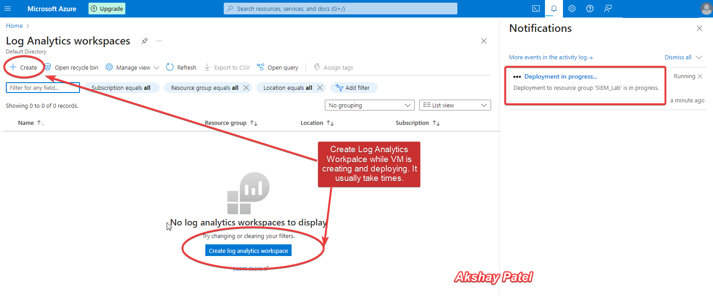
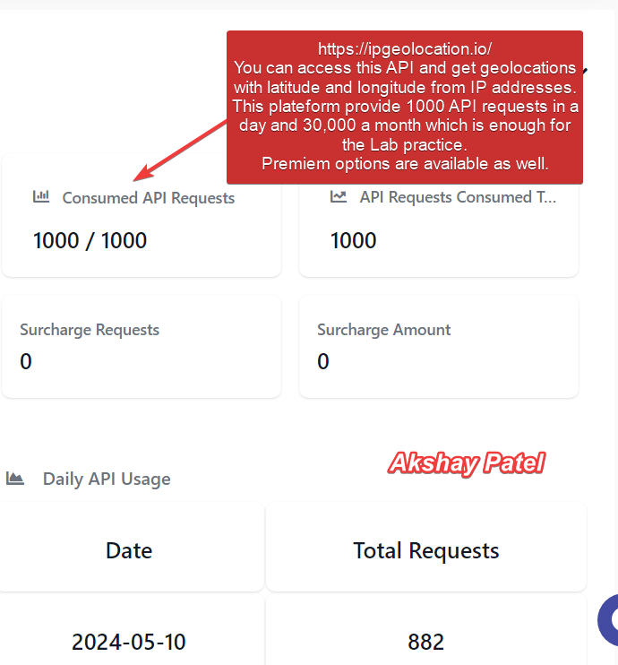

# Cloud Security Project: Monitoring and Responding to Failed Logon Attempts with Azure

## Overview

This project demonstrates how to use Microsoft Azure to create a secure cloud environment, monitor failed logon attempts, and respond to potential security incidents. It leverages Azure Virtual Machines, Azure Log Analytics, Microsoft Defender for Cloud, and Azure Sentinel. Additionally, this project involves adding custom log files, using an IP Geolocation API to get the exact location of IP addresses, and visualizing these locations in maps in Azure Sentinel. This comprehensive approach showcases my skills in using SIEM technology.

## Objectives

- Provision and configure a Windows 10 virtual machine in Azure.
- Expose the virtual machine to the internet and monitor it for security events.
- Use PowerShell to scan the Event Viewer for failed logon attempts (EventID 4625).
- Send log data to Azure Log Analytics and visualize it in Azure Sentinel.
- Use IPgeolocation.io API to map the origin of logon attempts.
- Implement incident response and remediation procedures.

## Features

- [**Microsoft Azure**](https://azure.microsoft.com/en-us/free/): Cloud platform for creating and managing virtual machines.
- [**Azure Log Analytics Workspace**](https://learn.microsoft.com/en-us/azure/azure-monitor/logs/log-analytics-workspace-overview): Collects and analyzes log data.
- [**Microsoft Defender for Cloud**](https://learn.microsoft.com/en-us/azure/defender-for-cloud/managing-and-responding-alerts): Provides security management and threat protection.
- [**Azure Sentinel**](https://learn.microsoft.com/en-us/azure/sentinel/overview?tabs=azure-portal): Cloud-native SIEM tool for monitoring and analyzing security data.
- [**PowerShell**](https://learn.microsoft.com/en-us/powershell/azure/get-started-azureps?view=azps-12.0.0): Script to scan Event Viewer and send log data to an external API.
- [**IPgeolocation.io API**](https://ipgeolocation.io/): Retrieves geolocation information for IP addresses.


## Step 1: Deploy Azure Virtual Machines

### Setting Up Virtual Machines
To begin, I deployed several Azure Virtual Machines (VMs) to create a baseline infrastructure. These VMs were configured with Windows Server and enabled for Remote Desktop Protocol (RDP). The VMs acted as honeypots to attract unauthorized access attempts.

1. **Creating VMs**: Using the Azure Portal, I created VMs by selecting the appropriate VM size, OS image, and configuring network settings.
2. **Enabling RDP**: Ensuring RDP was enabled on these VMs allowed for remote access, which was crucial for monitoring failed logon attempts.

### Screenshots
- **Screenshot 1**: VM creation process in Azure Portal.


- **Screenshot 2**: Network settings configuration for the VM.


## Step 2: Configuring Log Collection with Azure Log Analytics

### Creating a Log Analytics Workspace
I created an Azure Log Analytics Workspace to collect and analyze log data from the VMs. This workspace served as the central hub for all log-related activities.

1. **Workspace Creation**: I set up a new Log Analytics Workspace using the Azure Portal.
2. **Agent Installation**: Installed the Log Analytics agent on each VM to forward log data to the workspace.

### Configuring Data Collection
I configured the workspace to collect specific logs, such as Windows Event logs, which include details about failed RDP attempts. This setup ensured that all relevant security events were captured.

### Screenshots
- **Screenshot 3**: Log Analytics Workspace creation.





- **Screenshot 4**: Powershell script to create custom log and extract location using IPs.




- **Screenshot 5**: Configuration of data collection rules in Log Analytics.


- **Screenshot 6**: Example of a Custom log schema creation in Log Analytics. 


## Step 3: Implementing Microsoft Defender for Cloud

### Enabling Microsoft Defender for Cloud
To enhance the security of my Azure environment, I enabled Microsoft Defender for Cloud. This service provides advanced threat protection for Azure resources.

1. **Security Center Configuration**: Configured the Azure Security Center to monitor the VMs and provide security recommendations.
2. **Policy Assignment**: Applied security policies to ensure that the VMs adhered to best practices.

### Monitoring Security Alerts
Microsoft Defender for Cloud continuously monitored the environment and generated alerts for suspicious activities, such as repeated failed logon attempts.

### Screenshots
- **Screenshot 7**: Microsoft Defender for Cloud dashboard showing security posture.


## Step 4: Setting Up Azure Sentinel

### Deploying Azure Sentinel
To centralize security monitoring and incident response, I deployed Azure Sentinel. This cloud-native SIEM (Security Information and Event Management) system allowed for advanced threat detection and response.

1. **Connecting Data Sources**: Connected Azure Sentinel to the Log Analytics Workspace, enabling it to ingest log data from the VMs.
2. **Creating Analytics Rules**: Created custom analytics rules to detect failed logon attempts and other potential security incidents.

### Integrating IP Geolocation API
To enhance the analysis of failed logon attempts, I integrated an IP Geolocation API. This API converted IP addresses from the logs into geographical locations.

1. **API Integration**: Used an IP Geolocation API (such as MaxMind or IPstack) in an Azure Function to look up the geographical locations of IP addresses.
2. **Data Enrichment**: The Azure Function enriched the log data with latitude and longitude coordinates for each IP address.

### Visualizing Data in Azure Sentinel
Azure Sentinel provided a rich set of tools for visualizing security data and responding to incidents. I created dashboards to display real-time data on failed logon attempts, including geographical distribution and trends.

1. **Map Visualization**: Used Azure Sentinel’s built-in map visualizations to display the geographical locations of failed logon attempts on a world map.
2. **Incident Response**: Configured playbooks in Azure Sentinel to automate responses to detected incidents, enhancing the overall security posture.

### Screenshots
- **Screenshot 8**: Azure Sentinel dashboard showing connected data sources.


- **Screenshot 9**: Visualization of failed logon attempt locations on a map in Sentinel.


### 4. Monitoring with PowerShell

1. **PowerShell Script**:
    - Open PowerShell on the VM and create a script to scan Event Viewer for EventID 4625.
    - Use the IPgeolocation.io API to log the IP addresses and their geolocations.

    ```powershell
    $logPath = "C:\path\to\logfile.txt"
    $apiKey = "your_api_key"
    
    Get-EventLog -LogName Security -InstanceId 4625 | ForEach-Object {
        $ip = $_.ReplacementStrings[-2]
        $response = Invoke-RestMethod -Uri "https://api.ipgeolocation.io/ipgeo?apiKey=$apiKey&ip=$ip"
        $location = $response | Select-Object -ExpandProperty geo
        Add-Content -Path $logPath -Value "$($ip) - $($location.country_name)"
    }
    ```

### 6. Incident Response and Remediation

1. **Incident Detection**:
    - Set up alert rules in Azure Sentinel to detect suspicious activities, such as multiple failed logon attempts from the same IP.
    - Example KQL query to detect failed logon attempts:
    ```kql
    SecurityEvent
    | where EventID == 4625
    | summarize count() by IPAddress, bin(TimeGenerated, 1h)
    | where count_ > 5
    ```

2. **Response Actions**:
    - Automate responses using Azure Logic Apps to notify the SOC team.
    - Block malicious IP addresses using Azure Firewall or NSG rules.

3. **Reporting**:
    - Generate reports summarizing the incidents detected and actions taken.
    - Example report template:
    ```markdown
    ## Incident Report

    ### Incident Summary
    - **Date/Time**: 
    - **Description**: Multiple failed logon attempts detected from IP .

    ### Affected Resources
    - **Resource**: 
    - **Public IP**: 

    ### Actions Taken
    - **Action 1**: Blocked IP address using NSG rule.
    - **Action 2**: Notified SOC team via email.

    ### Recommendations
    - **Recommendation 1**: Implement multi-factor authentication (MFA).
    - **Recommendation 2**: Regularly review and update firewall rules.
    ```

## Conclusion

Through this project, I successfully demonstrated how to create a secure cloud environment using Microsoft Azure. By leveraging Azure Virtual Machines, Azure Log Analytics, Microsoft Defender for Cloud, and Azure Sentinel, I was able to monitor failed logon attempts and respond to potential security incidents effectively. The integration of custom log files and an IP Geolocation API allowed for precise location tracking and visualization of attack origins. This project showcases my ability to implement and manage advanced security solutions, utilizing SIEM technology to enhance threat detection and response.